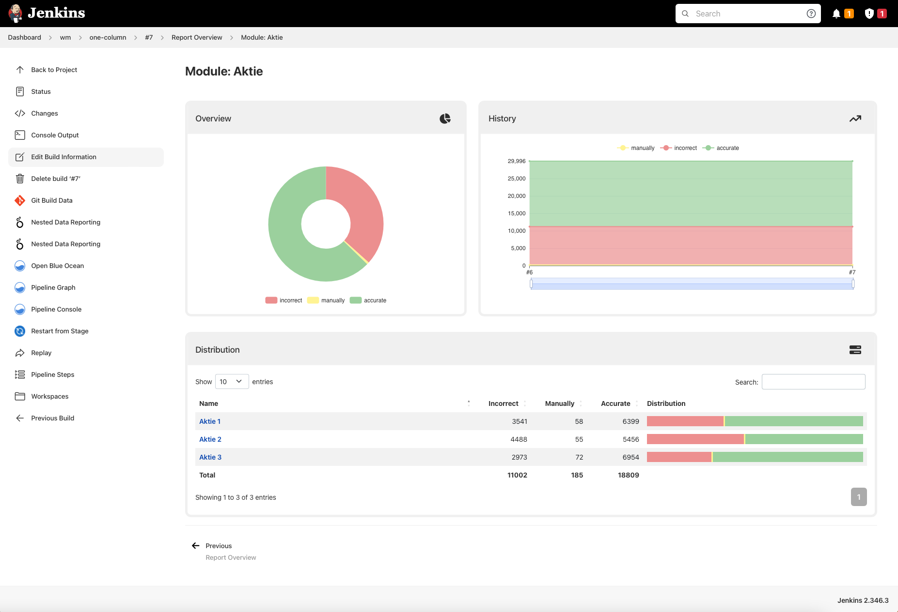
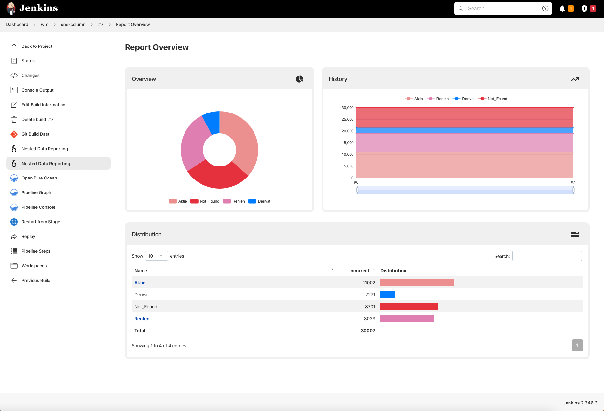

[](https://ci.jenkins.io/job/Plugins/job/nested-data-reporting-plugin/job/master/)


<br />
<p align="center">
  <a href="#">
    
  </a>

  <h1 align="center">Nested Data Reporting Plugin</h1>

  <p align="center">
    A Jenkins plugin to visualize nested data in pie charts, trend charts, and data tables.
    <br />
    <a href="https://github.com/jenkinsci/nested-data-reporting-plugin/blob/master/README.md"><strong>Explore the Docs »</strong></a>
    <br />
    <br />
    <a href="https://github.com/jenkinsci/nested-data-reporting-plugin/issues/new/choose">Report Bug</a>
    ·
    <a href="https://github.com/jenkinsci/nested-data-reporting-plugin/issues/new/choose">Request Feature</a>
  </p>
</p>

---

## Table of Contents

1. [Introduction](#introduction)
2. [Key Features](#key-features)
3. [Usage](#usage)
   - [Input Files](#input-files)
   - [Visualization](#visualization)
4. [Color Management](#color-management)
5. [Display Examples](#display-examples)
6. [Configuration](#configuration)
   - [Pipeline Parameters](#pipeline-parameters)
7. [Examples](#examples)
8. [Contributing](#contributing)
9. [Issues and Support](#issues-and-support)
10. [License](#license)
11. [Acknowledgments](#acknowledgments)

---

## Introduction

The **Nested Data Reporting Plugin** for Jenkins allows you to visualize complex, nested data from various file formats (JSON, YAML, XML, CSV) in an intuitive and interactive way. The plugin generates pie charts, trend charts, and data tables to help you analyze and monitor your data over time.

Whether you're tracking metrics, analyzing trends, or monitoring performance, this plugin provides a powerful way to display and interact with your data directly within Jenkins.

---

## Key Features

- **Visualize Nested Data**: Display hierarchical data structures in pie charts, trend charts, and tables.
- **Multiple File Formats**: Supports JSON, YAML, XML, and CSV files.
- **Dynamic UI**: Interactive charts and tables that update based on your data.
- **Customizable Colors**: Define custom colors for your data points or use predefined color schemes.
- **Trend Analysis**: Track data trends over multiple builds with history charts.
- **Pipeline Integration**: Easily integrate data reporting into your Jenkins pipelines.

---

## Usage

### Input Files

The plugin supports the following file formats for data input:

#### JSON
- Use a hierarchical structure with `id`, `name`, and `items` for nested data.
- Each item can have a `result` object containing key-value pairs for metrics.
- Example:
  ```json
  {
    "id": "report-id",
    "items": [
      {
        "id": "category-1",
        "name": "Category 1",
        "result": { "metric1": 10, "metric2": 20 }
      },
      {
        "id": "category-2",
        "name": "Category 2",
        "items": [
          {
            "id": "sub-category-1",
            "name": "Sub Category 1",
            "result": { "metric1": 5, "metric2": 15 }
          }
        ]
      }
    ]
  }
  ```
  To check your json you can use the [json schema](src/main/resources/report.json) to validate it.

#### CSV
- Use a flat structure with columns representing metrics.
- The first row should contain headers (column names).
- Example:

  ```csv
  id,name,metric1,metric2
  category-1,Category 1,10,20
  category-2,Category 2,5,15
  ```

#### YAML and XML
- Similar hierarchical structures as JSON are supported.

---

## Color Management

The plugin allows you to customize the colors used in the visualizations. You can define colors for specific metrics or categories to make your reports more visually appealing and easier to interpret.

### Customizing Colors

To customize colors, add a `colors` object to your JSON, YAML, or XML file. The `colors` object should map metric keys or category names to specific colors. Colors can be defined using **HEX values** or **predefined color names**.

> **Note**: Color customization is **not supported for CSV files**. Only JSON, YAML, and XML files allow color customization.

#### Example in JSON:
```json
{
  "id": "report-id",
  "items": [
    {
      "id": "category-1",
      "name": "Category 1",
      "result": { "metric1": 10, "metric2": 20 }
    }
  ],
  "colors": {
    "metric1": "#FF5733",  // HEX value
    "metric2": "BLUE"      // Predefined color name
  }
}
  ```

### Predefined Color Names

The following color names are supported:  
**YELLOW**, **LIME**, **GREEN**, **BLUE**, **TEAL**, **ORANGE**, **INDIGO**, **PURPLE**, **RED**, **BROWN**, **GRAY**, **WHITE**.

If no `colors` object is provided, the plugin will automatically generate a color palette.

---

## Visualization

The plugin dynamically generates:

- **Pie Charts**: Show the distribution of data.
- **Trend Charts**: Display data trends over time.
- **Data Tables**: Provide detailed breakdowns of your data.

You can interact with the charts and tables to drill down into specific data points.

---

## Configuration

### Pipeline Parameters

- **`name`**: The name of the report displayed in the UI.
- **`displayType`**: (Optional) Choose how metrics are displayed:
  - `absolute`: Show absolute values.
  - `relative`: Show percentage values.
  - `dual`: Show both absolute and relative values.
- **`provider`**: Specify the file format and pattern for the data files.
  - **`id`**: (Required for CSV) A unique identifier for the report.
  - **`pattern`**: An Ant-style pattern to locate the data files.


## Examples

Check out the [examples folder](/etc) for sample data files and pipeline scripts.



---

## Contributing

We welcome contributions from the community! If you'd like to contribute, please follow these steps:

1. Fork the repository.
2. Create a new branch (`git checkout -b feature/YourFeature`).
3. Commit your changes (`git commit -m 'Add some feature'`).
4. Push to the branch (`git push origin feature/YourFeature`).
5. Open a pull request.

---

## Issues and Support

If you encounter any issues or have feature requests, please [open an issue](https://github.com/jenkinsci/nested-data-reporting-plugin/issues) on GitHub.

---

## License

This project is licensed under the MIT License. See the [LICENSE](LICENSE) file for details.

---

## Acknowledgments

- Thanks to the Jenkins community for their support and contributions.
- Special thanks to all contributors who have helped improve this plugin.


